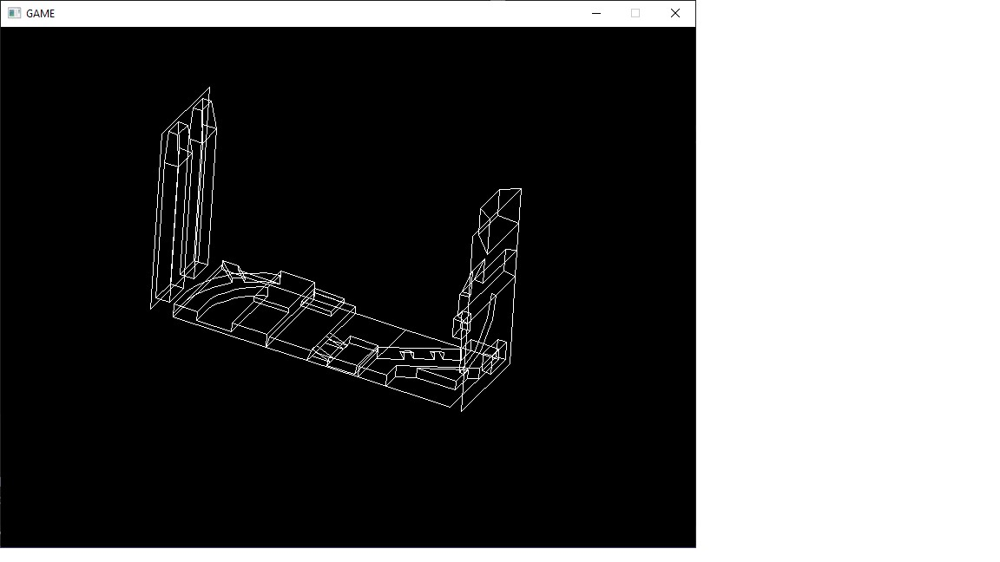

# SDL3-Basic-3D-Model-viewer
I made this to test 3D panels I'm creating for a Star Wars Deathstar Run animation I'm working on that runs on an ESP32 using the TGX library

Use arrow keys to rotate and w,s keys to move up/down

